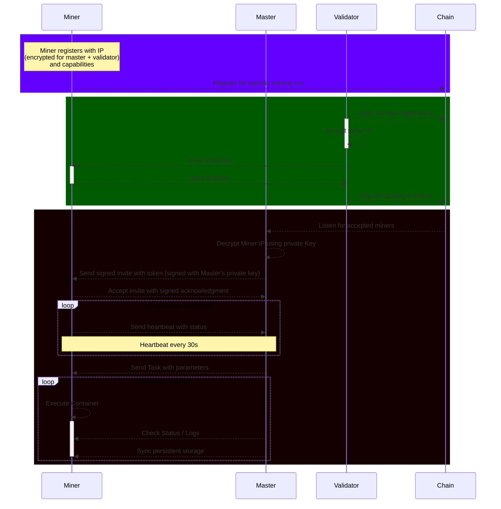

```mermaid
sequenceDiagram  

participant M as Miner  
participant MA as Master 
participant V as Validator
participant C as Chain  

rect rgb(100, 0, 255)
    Note over M: Miner registers with IP<br />(encrypted for master + validator)<br/>and capabilities
    M -->> C: Register for specific training run
end 

rect rgb(0, 90, 0)
V -->> C: Listen for new registrations
activate V 
V -->> V: decrypt miner IP
deactivate V
V -->> M: Send challenge
activate M
M -->> V: Send Solution 
deactivate M
V -->> C: Report Challenge Status

end  

rect rgb(20, 0, 0)
C -->> MA: Listen for accepted miners 
MA -->> MA: Decrypt Miner IP using private Key
MA -->> M: Send signed invite with token (signed with Master's private key)
M -->> MA: Accept invite with signed acknowledgment

loop Continuous heartbeat
    M -->> MA: Send heartbeat with status
    Note over M,MA: Heartbeat every 30s
end

MA -->> M: Send Task with parameters
loop Execute Container
    M -->> M: Execute Container
    activate M
    MA -->> M: Check Status / Logs 
    MA -->> M: Sync persistent storage 
    deactivate M
end

end
```
