# Prime Miner / Validator / Master 
The current setup is aimed to support intellect-2 with a limited number of validators and a central master that coordinates the workload on the miners.

## Development Milestones 
### 🚧 Milestone 1: Off-chain Miner and Master Node interaction  
> **Status**: In Progress
- See System Architecture Step 3. and 4.
- Build a simple ability to control the docker container running on the miners 
- Basic hardware detection and system check

### 📅 Milestone 2: Off-Chain Validator <> Miner Interaction 
> **Status**: Planned
- Allow validator to validate the miner's registration 
- Allow validator to send tasks to the miner and collect results 

### 📅 Milestone 3: On-Chain Miner Registration 
> **Status**: Planned
- Allow miner to register on-chain with encrypted IP and capabilities 

## System architecture (WIP)
The following system architecture still misses crucial components (e.g. terminations) and is simplified for the MVP / intellect-2 run.

```mermaid
sequenceDiagram  
participant B as Buyer <br />(via CLI / API)
participant MA as Master Node
participant M as Compute Provider
participant V as Validator
participant A as Arbitrum

rect rgb(0, 0, 0)
  Note over B,A: 0. Preparation Phase 
B-->>A: Create training run with node requirements
end
rect rgb(0, 0, 100)
   Note over M,A: 1. REGISTRATION PHASE
   Note over M: Compute Provider registers with IP<br/>(encrypted for master + validator)<br/>and capabilities (GPU / CPU / RAM)
   M-->>A: Register for specific training run
end 

rect rgb(0, 100, 0)
   Note over V,M: 2. VALIDATION PHASE
   V-->>A: Listen for new registrations
   activate V 
   V-->>V: Decrypt provider IP
   deactivate V
   V-->>M: Send challenge
   activate M
   M-->>V: Send Solution 
   deactivate M
   V-->>A: Report Challenge Status<br/>(approve / reject)
end  

rect rgb(100, 0, 0)
   Note over MA,M: 3. ONBOARDING PHASE
   A-->>MA: Listen for accepted providers 
   MA-->>MA: Decrypt Provider IP using private Key
   MA-->>M: Send signed invite with token<br/>(signed with Master Node's private key)
   M-->>MA: Accept invite with signed acknowledgment
   loop Continuous heartbeat
       M-->>MA: Send heartbeat with status
       Note over M,MA: Heartbeat every 30s
   end 
end  

rect rgb(150, 100, 0)
   Note over B,M: 4. EXECUTION PHASE
   B-->>MA: Create Task
   MA-->>M: Send Task with parameters
   loop Execute Container
       M-->>M: Execute Container
       activate M
       MA-->>M: Check Status / Logs 
       MA-->>M: Sync persistent storage 
       deactivate M
   end
   B-->>MA: Access Logs 
end
```

