# Prime Miner / Validator / Master 
The current setup is aimed to support intellect-2 with a limited number of validators and a central master that coordinates the workload on the miners.
## Clone the repository with submodules 
```
git clone --recurse-submodules https://github.com/prime-ai/prime-miner-validator.git
```
- Update submodules:
```
git submodule update --init --recursive
```
## Setup:
- Prerequisites:
    - Docker 
    - tmuxinator: Install via `gem install tmuxinator`
    - Rust: Install via `curl --proto '=https' --tlsv1.2 -sSf https://sh.rustup.rs | sh`

## Run locally: 
```
make up
``` - starts all services but not the miner
```
make watch-miner
``` - starts the miner
```
make down
``` - stops all services

## System architecture (WIP)
The following system architecture still misses crucial components (e.g. terminations) and is simplified for the MVP / intellect-2 run.

```mermaid
sequenceDiagram  
    participant B as Buyer <br />(via CLI / API)
    participant MA as Compute Coordinator<br /> (Master Node)
    participant M as Compute Provider
    participant V as Validator
    participant A as Arbitrum
    participant D as Discovery Service

    rect rgb(0, 0, 0)
        Note over B,A: 0. PREPARATION PHASE 
        B->>MA: Setup Master Node(s) 
        B->>A: Create training run with node requirements <br /> and discovery service URI 
    end

    rect rgb(0, 0, 100)
        Note over M,A: 1. REGISTRATION PHASE
        Note over M: Compute Provider registers with capabilities (GPU / CPU / RAM)
        M->>A: Register for specific training run
        M->>D: Register Node IP with discovery service
        activate D
        D->>A: Check if node is registered
        D-->>M: Confirm registration
        deactivate D
    end 

    rect rgb(0, 100, 0)
        Note over V,M: 2. VALIDATION PHASE
        A -->> V: Listen for new miner registrations
        opt New Miner is registered
        V ->> D: Request Miner IP
        D -->> V: Return Miner IP
        V-->>M: Send challenge
        activate M
        M->>V: Send Solution 
        deactivate M
        V->>A: Report Challenge Status<br/>(approve / reject)
        end
        M->>A: Monitor chain for acceptance status
        A-->>M: Return acceptance status
    end  

    rect rgb(100, 0, 0)
        Note over MA,M: 3. ONBOARDING PHASE
        A -->> MA: Listen for new miner registrations
        opt New Miner is registered
        MA ->> D: Request Miner IP with signature
        activate D
        D ->> A: Check if MA owns training run 
        D -->> MA: Return Miner IP
        deactivate D
        MA->>M: Send signed invite<br/>(signed with Master Node's private key)
        M->>A: Verify Master Node's signature
        A-->>M: Confirm Master Node status
        M-->>MA: Accept invite with signed acknowledgment
        end
        loop Continuous heartbeat
            M->>MA: Send heartbeat with status
            Note over M,MA: Heartbeat every 30s
        end 
    end  

    rect rgb(150, 100, 0)
        Note over B,M: 4. EXECUTION PHASE
        B->>MA: Create Task
        MA->>M: Send Task with parameters
        loop Execute Container
            M->>M: Execute Container
            activate M
            MA->>M: Check Status / Logs 
            M-->>MA: Return status/logs
            MA->>M: Sync persistent storage 
            M-->>MA: Sync acknowledgment
            deactivate M
        end
        B->>MA: Access Logs 
        MA-->>B: Return logs
    end
```


