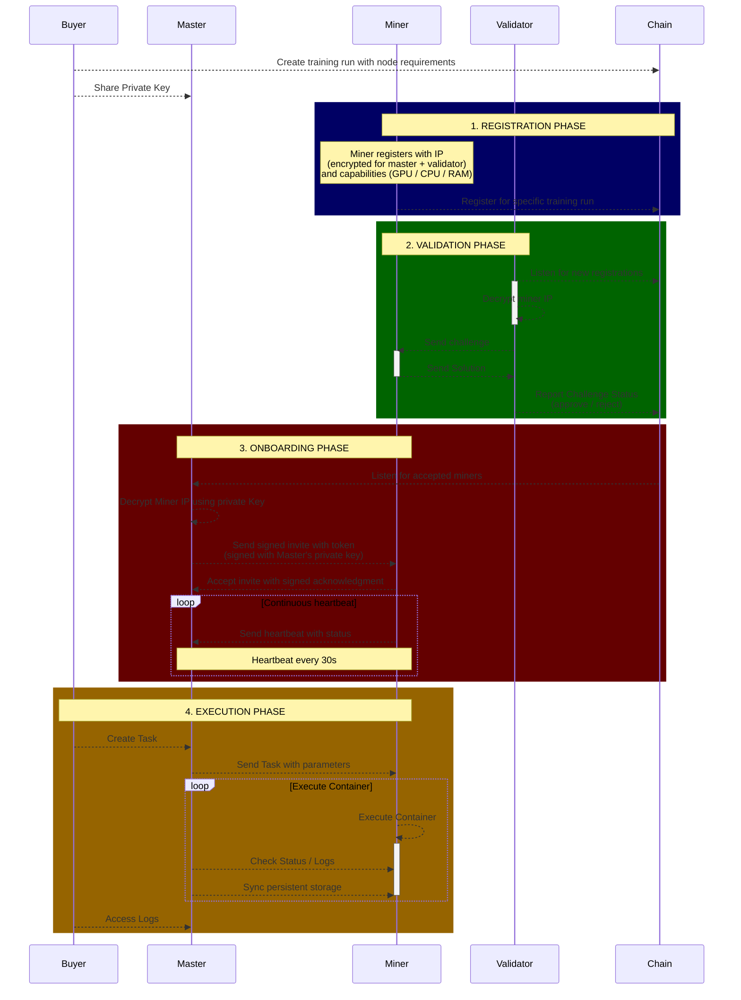

# Prime Miner / Validator / Master 
The current setup is aimed to support intellect-2 with a limited number of validators and a central master that coordinates the workload on the miners.

## System architecture

