# Protocol 
Prime Protocol is a peer-to-peer compute and intelligence network that enables decentralized AI development at scale. This repository contains the core infrastructure for contributing compute resources to the network, including miners, validators, and the coordination layer.

## Setup:
### Clone the repository with submodules  
```
git clone --recurse-submodules https://github.com/prime-ai/prime-miner-validator.git
```
- Update submodules:
```
git submodule update --init --recursive
```
### Installation
- Foundry: `curl -L https://foundry.paradigm.xyz | bash` - do not forget `foundryup`
- Docker 
- tmuxinator: Install via `gem install tmuxinator` - do not use brew, apparently their brew build is broken
- Rust: Install via `curl --proto '=https' --tlsv1.2 -sSf https://sh.rustup.rs | sh`
- Install cargo watch: `cargo install cargo-watch`
- Install redis-server: `brew install redis`(mac) or `sudo apt-get install redis-server`(ubuntu)
- Adjust docker desktop setting: `Allow the default Docker socket to be used (requires password)` must be enabled
- .env in base folder and .env in discovery folder (will be replaced shortly)

## Run locally: 
### On very first run we have to pre-build some components:
- `docker compose up` - to pull anvil, redis and start discovery service
- `make whitelist-provider` - to build the whitelist provider function which runs in the background

Once both commands complete you can terminate and proceed to the official commands:
### Commands:
```
# Start tmux env
make up

# Start miner in tmux env
make watch-miner

# Stop tmux env
make down
```
## Run on remote machine:
Run initial setup once:
Run miner:
```
export EXTERNAL_IP=machine ip
export SSH_CONNECTION="ssh ubuntu@ip -i private_key.pem"
make remote-miner
```

## Start a runner for dev

First, you need to create a local miner (after you have all other services running using e.g. `make up`) 

```bash
make watch-miner
```

check that the miner as been registered

```bash
curl -X GET http://localhost:8090/nodes
>>> {"nodes":[{"address":"0x66295e2b4a78d1cb57db16ac0260024900a5ba9b","ip_address":"0.0.0.0","port":8091,"status":"Healthy","task_id":null,"task_state":null}],"success":true}
```


then lets create a task

```bash
curl -X POST http://localhost:8090/tasks -H "Content-Type: application/json" -d '{"name":"sample","image":"ubuntu:latest"}'
>>> {"success":true,"task":"updated_task"}% 
```

and check that the task is created

```bash
curl -X GET http://localhost:8090/nodes
>>> {"nodes":[{"address":"0x66295e2b4a78d1cb57db16ac0260024900a5ba9b","ip_address":"0.0.0.0","port":8091,"status":"Healthy","task_id":"29edd356-5c48-4ba6-ab96-73d002daddff","task_state":"RUNNING"}],"success":true}%     
```

you can also check docker ps to see that the docker is running locally

```bash
docker ps
CONTAINER ID   IMAGE                               COMMAND                  CREATED          STATUS          PORTS                                         NAMES
e860c44a9989   ubuntu:latest                       "sleep infinity"         3 minutes ago    Up 3 minutes                                                  prime-task-29edd356-5c48-4ba6-ab96-73d002daddff
ef02d23b5c74   redis:alpine                        "docker-entrypoint.s…"   27 minutes ago   Up 27 minutes   0.0.0.0:6380->6379/tcp, [::]:6380->6379/tcp   prime-miner-validator-redis-1
7761ee7b6dcf   ghcr.io/foundry-rs/foundry:latest   "anvil --host 0.0.0.…"   27 minutes ago   Up 27 minutes   0.0.0.0:8545->8545/tcp, :::8545->8545/tcp     prime-miner-validator-anvil-1
```


## System architecture (WIP)
The following system architecture still misses crucial components (e.g. terminations) and is simplified for the MVP / intellect-2 run.

```mermaid
sequenceDiagram  
    participant B as Buyer <br />(via CLI / API)
    participant MA as Compute Coordinator<br /> (Master Node)
    participant M as Compute Provider
    participant V as Validator
    participant A as Arbitrum
    participant D as Discovery Service

    rect rgb(0, 0, 0)
        Note over B,A: 0. PREPARATION PHASE 
        B->>MA: Setup Master Node(s) 
        B->>A: Create training run with node requirements <br /> and discovery service URI 
    end

    rect rgb(0, 0, 100)
        Note over M,A: 1. REGISTRATION PHASE
        Note over M: Compute Provider registers with capabilities (GPU / CPU / RAM)
        M->>A: Register for specific training run
        M->>D: Register Node IP with discovery service
        activate D
        D->>A: Check if node is registered
        D-->>M: Confirm registration
        deactivate D
    end 

    rect rgb(0, 100, 0)
        Note over V,M: 2. VALIDATION PHASE
        A -->> V: Listen for new miner registrations
        opt New Miner is registered
        V ->> D: Request Miner IP
        D -->> V: Return Miner IP
        V-->>M: Send challenge
        activate M
        M->>V: Send Solution 
        deactivate M
        V->>A: Report Challenge Status<br/>(approve / reject)
        end
        M->>A: Monitor chain for acceptance status
        A-->>M: Return acceptance status
    end  

    rect rgb(100, 0, 0)
        Note over MA,M: 3. ONBOARDING PHASE
        A -->> MA: Listen for new miner registrations
        opt New Miner is registered
        MA ->> D: Request Miner IP with signature
        activate D
        D ->> A: Check if MA owns training run 
        D -->> MA: Return Miner IP
        deactivate D
        MA->>M: Send signed invite<br/>(signed with Master Node's private key)
        M->>A: Verify Master Node's signature
        A-->>M: Confirm Master Node status
        M-->>MA: Accept invite with signed acknowledgment
        end
        loop Continuous heartbeat
            M->>MA: Send heartbeat with status
            Note over M,MA: Heartbeat every 30s
        end 
    end  

    rect rgb(150, 100, 0)
        Note over B,M: 4. EXECUTION PHASE
        B->>MA: Create Task
        MA->>M: Send Task with parameters
        loop Execute Container
            M->>M: Execute Container
            activate M
            MA->>M: Check Status / Logs 
            M-->>MA: Return status/logs
            MA->>M: Sync persistent storage 
            M-->>MA: Sync acknowledgment
            deactivate M
        end
        B->>MA: Access Logs 
        MA-->>B: Return logs
    end
```

