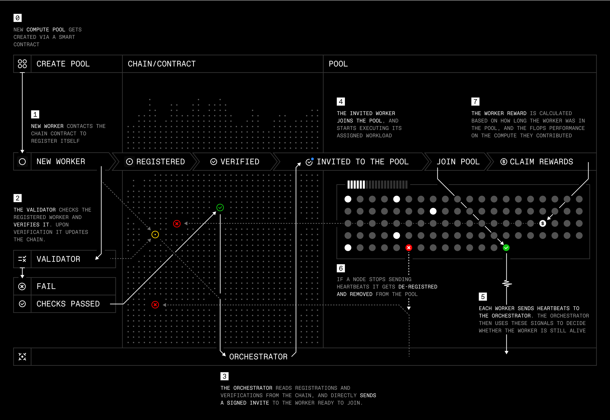

# Protocol

<div align="center">

  <h3>Decentralized Compute Infrastructure for AI</h3>
</div>

A peer-to-peer compute protocol for decentralized AI development at scale. This protocol implementation powered distributed training runs including [synthetic-2](https://app.primeintellect.ai/intelligence/synthetic-2) and [intellect-2](https://app.primeintellect.ai/intelligence/intellect-2).

This repository contains the core infrastructure for coordinating compute resources across a distributed network, including workers, validators, and the orchestration layer.

## 📚 Table of Contents
- [System Architecture](#system-architecture)
- [Getting Started](#getting-started)
- [Documentation](#documentation)
- [Frequently Asked Questions](#frequently-asked-questions)
- [Community](#community)
- [Contributing](#contributing)
- [Security](#security)
- [License](#license)

## System Architecture
The protocol follows a modular architecture designed for decentralized AI compute:

<div align="center">
  
</div>

### Component Overview
- **Smart Contracts**: Ethereum-based contracts manage the protocol's economic layer
- **Discovery Service**: Enables secure peer discovery and metadata sharing 
- **Orchestrator**: Coordinates compute jobs across worker nodes
- **Validator Network**: Ensures quality through random challenges
- **Worker Nodes**: Execute AI workloads in secure containers

## Getting Started

### Prerequisites
- Linux operating system
- CUDA-capable GPU(s) for worker operations
- Docker (version 28.1.1 or later) and Docker Compose (version v2.35.1 or later)

For complete setup instructions, refer to our [Development Setup Guide](docs/development-setup.md).

### Install Worker CLI: 
You can install the latest worker CLI using:
```
curl -sSL https://raw.githubusercontent.com/PrimeIntellect-ai/protocol/main/crates/worker/scripts/install.sh | bash 
```
This can also be used to upgrade the current installation to the latest release.

For the latest dev build use: 
```
curl -sSL https://raw.githubusercontent.com/PrimeIntellect-ai/protocol/develop/crates/worker/scripts/install.sh | bash -s -- --dev
```

## Documentation
- [Development Setup Guide](docs/development-setup.md) - Detailed installation and environment setup instructions
- [Usage Guide](docs/usage-guide.md) - Instructions for dispatching tasks, monitoring, and system management

## Frequently Asked Questions

#### Q: What is this protocol?
**A:** This is a peer-to-peer compute protocol implementation for decentralized AI development at scale. It provides infrastructure for coordinating compute resources across a distributed network through workers, validators, and an orchestration layer. This protocol powered distributed training runs including [synthetic-2](https://app.primeintellect.ai/intelligence/synthetic-2) and [intellect-2](https://app.primeintellect.ai/intelligence/intellect-2).

#### Q: Can I run this protocol locally?
**A:** Yes, you can run the protocol locally for development and testing purposes. 

#### Q: What environment variables do I need for local development?
**A:** We have provided an .env.example file with the required variables. 

#### Q: How are private keys managed securely in the system?
**A:** We're actively developing our security practices for private key management. 

#### Q: What are the recommended network isolation strategies for the worker?
**A:** We will be providing detailed documentation on how to secure workers with firewalls for ingress / egress 

#### Q: What are the funding requirements for workers?
**A:** For the current development phase, minimal testnet ETH is sufficient. Detailed information on setting up the worker will follow.

## Community
- [Discord](https://discord.gg/primeintellect)
- [X](https://x.com/PrimeIntellect)
- [Blog](https://www.primeintellect.ai/blog)

## Contributing
We welcome contributions! Please see our [Contributing Guidelines](CONTRIBUTING.md).

## Security
See [SECURITY.md](SECURITY.md) for security policies and reporting vulnerabilities.