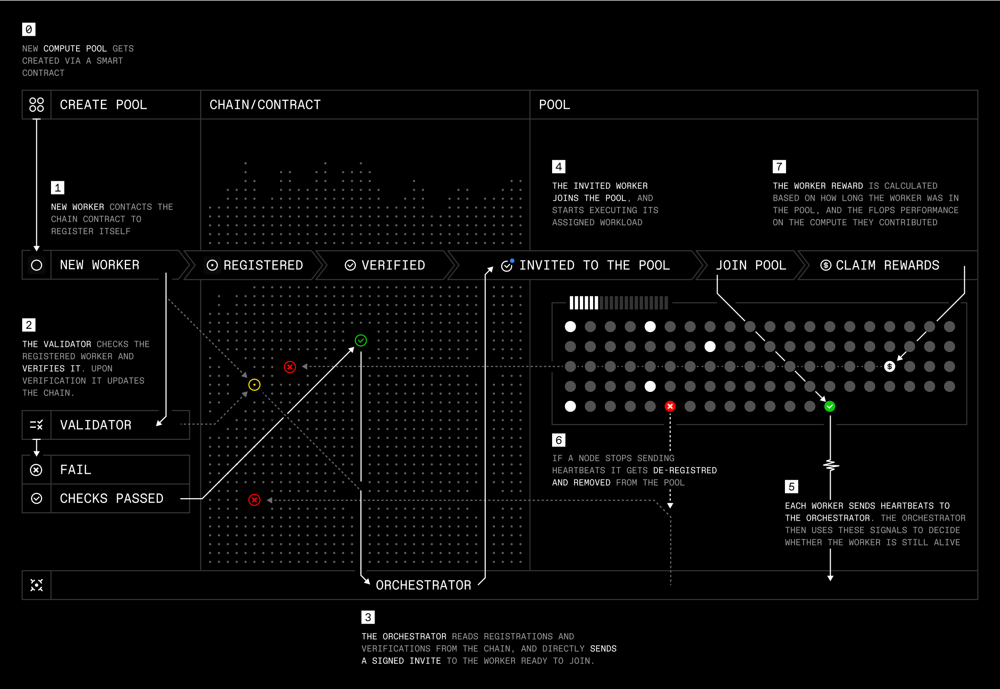

# Protocol

<div align="center">

  <h3>Decentralized Compute Infrastructure for AI</h3>
</div>

> ⚠️ **IMPORTANT**: This project is still under active development. Currently, you can only run the protocol locally - connecting to public RPCs is not yet supported. Please check back later for updates.

Prime Network is a peer-to-peer compute and intelligence network that enables decentralized AI development at scale. This repository contains the core infrastructure for contributing compute resources to the network, including workers, validators, and the coordination layer.

## 📚 Table of Contents
- [System Architecture](#system-architecture)
- [Getting Started](#getting-started)
- [Installation](#installation)
- [Usage](#usage)
- [Development](#development)
- [Community](#community)
- [Contributing](#contributing)
- [Security](#security)
- [License](#license)
## System Architecture

The Prime Protocol follows a modular architecture designed for decentralized AI compute:

<div align="center">
  
</div>

### Component Overview

- **Smart Contracts**: Ethereum-based contracts manage the protocol's economic layer
- **Discovery Service**: Enables secure peer discovery and metadata sharing 
- **Orchestrator**: Coordinates compute jobs across worker nodes
- **Validator Network**: Ensures quality through random challenges
- **Worker Nodes**: Execute AI workloads in secure containers

## Getting Started

### Prerequisites

Before running Prime Protocol, ensure you have the following requirements:

#### Hardware
- Linux or macOS operating system
- CUDA-capable GPU(s) for mining operations

#### Software
- [Docker Desktop](https://www.docker.com/products/docker-desktop/) - Container runtime
- [Git](https://git-scm.com/) - Version control
- [Rust](https://www.rust-lang.org/) - Programming language and toolchain
- [Redis](https://redis.io/) - In-memory data store
- [Foundry](https://book.getfoundry.sh/) - Smart contract development toolkit
- [tmuxinator](https://github.com/tmuxinator/tmuxinator) - Terminal session manager

## Installation

### 1. Clone Repository
```bash
git clone --recurse-submodules https://github.com/prime-ai/protocol.git
cd protocol
git submodule update --init --recursive
```

### 2. Install Dependencies
```bash
# Install Foundry
curl -L https://foundry.paradigm.xyz | bash
foundryup

# Install Rust
curl --proto '=https' --tlsv1.2 -sSf https://sh.rustup.rs | sh

# Install cargo-watch
cargo install cargo-watch

# Install Redis (MacOS)
brew install redis

# Install Redis (Ubuntu)
# sudo apt-get install redis-server

# Install tmuxinator (do not use brew)
gem install tmuxinator
```

### 3. Configure Environment
- Enable "Allow the default Docker socket to be used" in Docker Desktop settings
- Create `.env` files in base folder and discovery folder

## Development

### Starting the Development Environment

To start all core services:
```bash
make up
```

This will launch:
- Local blockchain node
- Discovery service
- Validator node
- Orchestrator service
- Redis instance
- Supporting infrastructure

### Running a Worker Node

Once the core services are running, you can start a worker node in a new terminal:
```bash
make watch-worker
```

The worker will automatically connect to the discovery service and begin processing tasks.
It takes a couple of seconds until the worker is whitelisted. This is done using a simple loop on the second page of tmux.

You can find more details on the APIs in the orchestrator and discovery service directory.

### Deploying a task

First, you need to create a local worker (after you have all other services running using e.g. `make up`) 

```bash
make watch-worker
```

check that the worker as been registered on the orchestrator: 

```bash
curl -X GET http://localhost:8090/nodes -H "Authorization: Bearer admin"
>>> {"nodes":[{"address":"0x66295e2b4a78d1cb57db16ac0260024900a5ba9b","ip_address":"0.0.0.0","port":8091,"status":"Healthy","task_id":null,"task_state":null}],"success":true}
```


then lets create a task

```bash
curl -X POST http://localhost:8090/tasks -H "Content-Type: application/json" -H "Authorization: Bearer admin" -d '{"name":"sample","image":"ubuntu:latest"}'
>>> {"success":true,"task":"updated_task"}% 
```

and check that the task is created

```bash
curl -X GET http://localhost:8090/nodes -H "Authorization: Bearer admin"
>>> {"nodes":[{"address":"0x66295e2b4a78d1cb57db16ac0260024900a5ba9b","ip_address":"0.0.0.0","port":8091,"status":"Healthy","task_id":"29edd356-5c48-4ba6-ab96-73d002daddff","task_state":"RUNNING"}],"success":true}%     
```

you can also check docker ps to see that the docker is running locally

```bash
docker ps
CONTAINER ID   IMAGE                               COMMAND                  CREATED          STATUS          PORTS                                         NAMES
e860c44a9989   ubuntu:latest                       "sleep infinity"         3 minutes ago    Up 3 minutes                                                  prime-task-29edd356-5c48-4ba6-ab96-73d002daddff
ef02d23b5c74   redis:alpine                        "docker-entrypoint.s…"   27 minutes ago   Up 27 minutes   0.0.0.0:6380->6379/tcp, [::]:6380->6379/tcp   prime-worker-validator-redis-1
7761ee7b6dcf   ghcr.io/foundry-rs/foundry:latest   "anvil --host 0.0.0.…"   27 minutes ago   Up 27 minutes   0.0.0.0:8545->8545/tcp, :::8545->8545/tcp     prime-worker-validator-anvil-1
```


### Stopping Services

To gracefully shutdown all services:
```bash
make down
```

### Remote GPU Development Setup

Start the local development environment:
```
make up
```
Set up your remote GPU worker:
1. Provision a GPU instance and ensure Docker is installed
2. Configure environment variables and start the remote worker:
```
SSH_CONNECTION="ssh your-ssh-conn string"
EXTERNAL_IP="your-external-ip"
make remote-worker
```
## Community

- [Discord](https://discord.gg/primeintellect)
- [X](https://x.com/PrimeIntellect)
- [Blog](https://www.primeintellect.ai/blog)

## Contributing
We welcome contributions! Please see our [Contributing Guidelines](CONTRIBUTING.md).

## Security
See [SECURITY.md](SECURITY.md) for security policies and reporting vulnerabilities.
